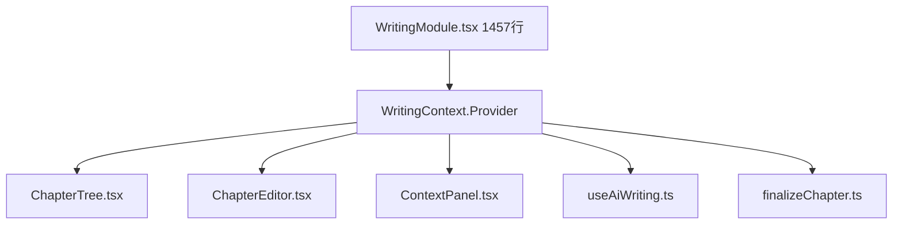

# R-T6 — WritingModule.tsx 瘦身

> 对应验收：V-T6（`verification3.0/T6-verification.md`）  
> 优先级：**P0**（God File 1457 行 → ≤300 行）

---

## 问题描述

T6.7 要求 WritingModule.tsx ≤300 行。当前 **1457 行**，5 个子文件已抽取但为**空壳**，主文件未将逻辑移入子文件。

| 子文件 | 行数 | 当前状态 |
|--------|:--:|------|
| `ChapterTree.tsx` | 171 | 含 UI，主文件仍在重复渲染逻辑 |
| `ChapterEditor.tsx` | 121 | 含编辑器壳，主文件仍持有 TipTap 逻辑 |
| `ContextPanel.tsx` | 135 | 含面板壳，数据获取仍在主文件 |
| `useAiWriting.ts` | 219 | 含 hook，主文件仍内联 AI 写作逻辑 |
| `WritingContext.tsx` | 17 | Context 定义，未被主文件使用 |
| `finalizeChapter.ts` | 52 | ✅ 已独立使用 |

---

## 剩余架构

主文件 1457 行中，可以在不破坏功能的前提下移走的模块：

| 模块 | 约行数 | 目标位置 |
|------|:--:|------|
| ChapterTree 渲染 + 拖拽 + 增删改 | ~250 行 | `ChapterTree.tsx` |
| TipTap 编辑器 + 工具栏 + 保存 | ~300 行 | `ChapterEditor.tsx` |
| 上下文面板数据获取 + 渲染 | ~200 行 | `ContextPanel.tsx` |
| AI 写本章/润色/去 AI 味/续写 | ~250 行 | `useAiWriting.ts` |
| 撤销/重做栈 | ~80 行 | `useAiWriting.ts` |
| 自动保存逻辑 | ~100 行 | `WritingContext.tsx` 中介 |
| 壳（组合 + Provider） | ≤150 行 | `WritingModule.tsx` |
| **总计** | **~1330 移出** | **主文件 ~120 行** |

---

## 具体改动策略

### 步骤 1：让 WritingContext 承载共享状态

WritingModule 中 `setChapters`/`setEditingContent`/`setIsDirty`/`autosaveStatus`/`pushUndo` 等通过 `WritingContext.Provider` 传递。

### 步骤 2：按依赖顺序迁移子组件



每迁移一个子模块，从主文件中删除对应代码，验证 build 通过，再移下一个。

### 步骤 3：主文件最终形态

```tsx
// WritingModule.tsx — 约 120 行
export function WritingModule() {
    const { pid } = useAppStore();
    if (!pid) return <EmptyState />;

    return (
        <WritingProvider pid={pid}>
            <div className="writing-layout">
                <ChapterTree />
                <ChapterEditor />
            </div>
            <AiWriteDialog />
            <ContextPanel />
        </WritingProvider>
    );
}
```

---

## 验证标准

### 自动化

- [ ] `npm run build` 通过
- [ ] `npm run test` 全绿
- [ ] WritingModule.tsx ≤ **300 行**
- [ ] 每个子文件 ≥ 原功能行数（非空壳）

### 回归测试计划

> 此为 P0 高风险重构，**每迁移一个子模块后**必须执行以下快速回归：
> 1. `npm run build` — 编译零错误
> 2. `npm run test` — 28 用例全绿
> 3. 冒烟测试（M1-M2）— 写+保存+定稿链路不断

### 手动测试清单

> 验收方逐项操作勾选，一项不通过即判定 R-T6 未完成。

| # | 操作步骤 | 预期结果 | 对应验收 |
|---|---------|---------|:--:|
| M1 | 新建章节 → 输入内容 → 点击保存 → 刷新页面 | 章节内容完整保留 | V-T6 V4/V5 |
| M2 | 右键章节 → 删除 → 确认 | 章节从列表中移除，其他章节不受影响 | V-T6 V4 |
| M3 | 点击"定稿" → 查看弹窗中 4 步结果 | 4 步均显示 ✅（保存/更新记忆/创建备份/创建快照），任一步失败显示具体错误 | V-T6 V4 |
| M4 | 点击"AI 写本章" → 等待生成 | 内容正确生成到编辑器中，上下文面板数据一致 | V-T6 V5 |
| M5 | 点击"润色" → 等待完成 | 编辑器内容被替换为润色后版本 | V-T6 V5 |
| M6 | 编辑内容后 Ctrl+Z 撤销 / Ctrl+Y 重做 | 内容正确回退/恢复，撤销栈正常工作 | V-T6 V5 |

---

## 预估影响

| 文件 | 改动量 | 风险评估 |
|------|:--:|------|
| `WritingModule.tsx` | -1130 行 | 高（核心写作流程重构） |
| `ChapterTree.tsx` | +80 行 | 中 |
| `ChapterEditor.tsx` | +180 行 | 中 |
| `ContextPanel.tsx` | +65 行 | 低 |
| `useAiWriting.ts` | +30 行 | 中 |
| `WritingContext.tsx` | +50 行 | 中 |
